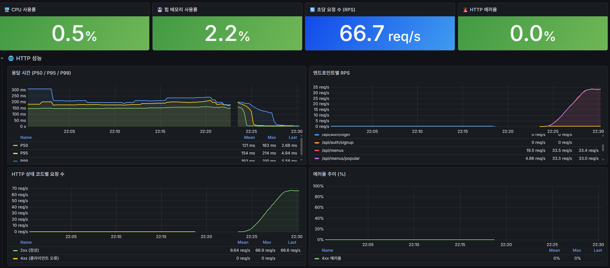
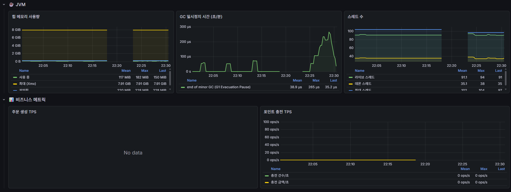
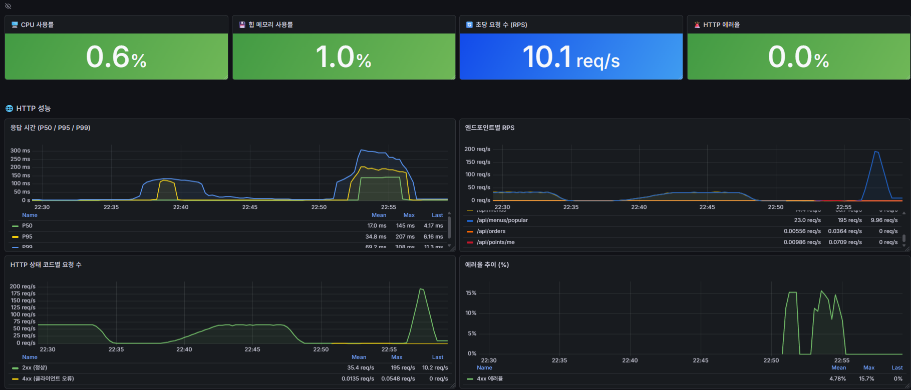
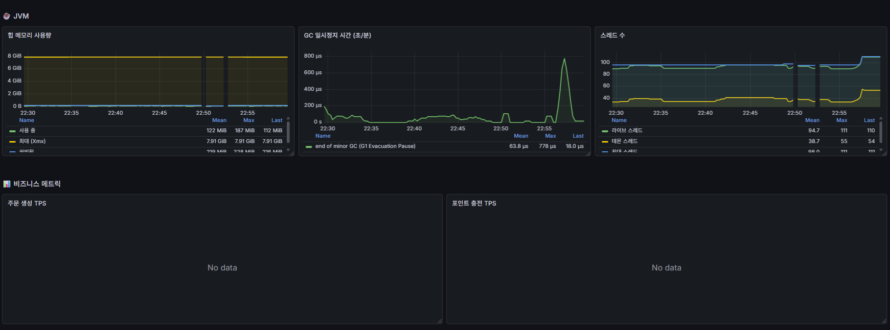
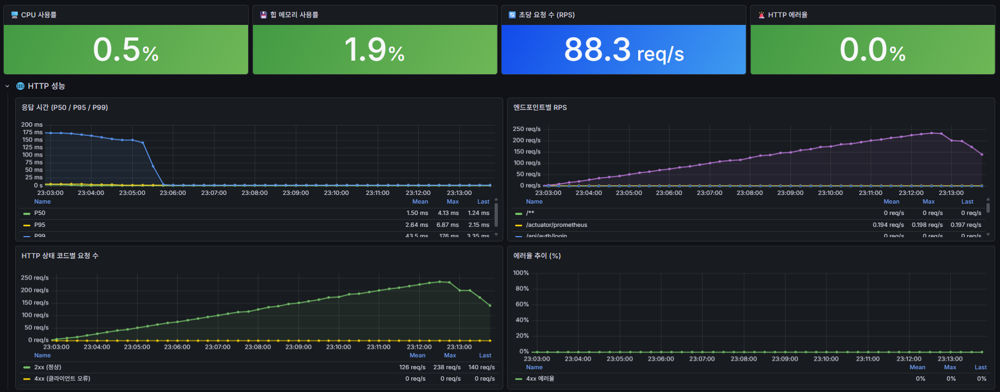
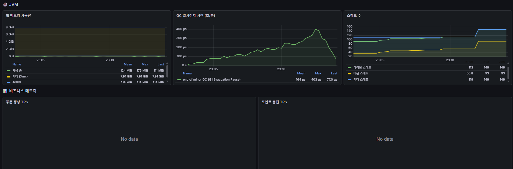

# ☕ CoffeeShop 주문 시스템

> 다수 서버 환경에서도 안정적으로 동작하는 커피숍 주문 시스템  
> **동시성 제어 · 데이터 일관성 · 분산 환경 확장성**을 중심으로 설계했습니다.

<br>

## 📎 링크

| 항목 | 링크 |
|---|---|
| 📋 API 명세서 (Postman) | [API 문서 바로가기](https://coffee-shop.docs.buildwithfern.com/coffee-shop/%EB%A9%94%EB%89%B4/read/%EB%A9%94%EB%89%B4-%EB%AA%A9%EB%A1%9D-%EC%A1%B0%ED%9A%8C-%EC%84%B1%EA%B3%B5) |
| 📊 ERD | [ERD Cloud 바로가기](https://www.erdcloud.com/d/rnRyzNHZ5RcTm79uX) |
| 📝 설계 노션 | [Notion 바로가기](https://rectangular-stingray-79b.notion.site/353d6fa994cf804883dac68c8f104e0f?v=353d6fa994cf801db359000c536f4157&source=copy_link) |

<br>

## 🛠 기술 스택

| 분류 | 기술 |
|---|---|
| Language | Java 17 |
| Framework | Spring Boot 3.x |
| ORM | Spring Data JPA, QueryDSL |
| Database | MySQL 8.0 (AWS RDS), H2 (로컬) |
| Cache / Lock | Redis (Redisson 분산 락, ZSET 집계) |
| Message Queue | Apache Kafka |
| Infra | AWS EC2, RDS, ALB, SSM Parameter Store |
| Monitoring | Prometheus, Grafana |
| Load Test | k6 |
| Security | JWT, Spring Security |

<br>

## 🏗 아키텍처

```
[Client]
    ↓
[ALB - Application Load Balancer]
    ↓                ↓
[EC2 App #1]    [EC2 App #2]
Spring Boot      Spring Boot
    ↓                ↓
    └────────┬────────┘
             ↓
    ┌─────────────────┐
    │  EC2 Infra      │
    │  Redis 7.2      │
    │  Kafka 7.5.0    │
    │  Prometheus     │
    │  Grafana        │
    └─────────────────┘
             ↓
    ┌─────────────────┐
    │  AWS RDS        │
    │  MySQL 8.0      │
    └─────────────────┘
```

> 다수 서버 환경에서 스케줄러 중복 실행 방지를 위해 **ShedLock**을 적용했습니다.  
> 민감 정보는 **AWS SSM Parameter Store (SecureString)** 로 중앙 관리합니다.

<br>

## 📌 API 목록

| Method | Path | 설명 | 인증 |
|---|---|---|---|
| POST | /api/auth/signup | 회원가입 | ❌ |
| POST | /api/auth/login | 로그인 | ❌ |
| POST | /api/auth/reissue | 토큰 재발급 | ❌ |
| POST | /api/auth/logout | 로그아웃 | ✅ |
| GET | /api/menus | 메뉴 목록 조회 | ❌ |
| GET | /api/menus/{menuId} | 메뉴 상세 조회 | ❌ |
| POST | /api/menus | 메뉴 생성 | ADMIN |
| PUT | /api/menus/{menuId} | 메뉴 수정 | ADMIN |
| DELETE | /api/menus/{menuId} | 메뉴 삭제 | ADMIN |
| GET | /api/menus/popular | 인기 메뉴 Top3 조회 | ❌ |
| POST | /api/points/charge | 포인트 충전 | ✅ |
| GET | /api/points/me | 포인트 조회 | ✅ |
| POST | /api/orders | 주문 생성 + 결제 | ✅ |
| GET | /api/orders | 내 주문 목록 | ✅ |
| GET | /api/orders/{orderUid} | 주문 상세 조회 | ✅ |
| DELETE | /api/orders/{orderUid} | 주문 삭제 | ✅ |

<br>

## 🧠 설계 의도 및 기술적 선택 이유

### 1. 동시성 제어 전략

> "왜 포인트에는 비관적 락, 메뉴 수정에는 낙관적 락을 선택했는가?"

#### 포인트 충전/차감 — 비관적 락 (PESSIMISTIC_WRITE)

포인트는 금융 데이터와 동일한 성격입니다. 충돌 발생 시 재시도를 허용하면 사용자 경험이 나빠지고 복잡한 재시도 로직이 필요합니다.  
`SELECT ... FOR UPDATE`로 트랜잭션 시작 시점에 락을 획득하여 충돌 자체를 차단했습니다.

```
User 조회 (FOR UPDATE) → 포인트 변경 → 커밋 → 락 해제
동시 요청은 대기 → 순차 처리 → 잔액 정합성 보장
```

#### 재고 차감 — 비관적 락 (PESSIMISTIC_WRITE)

낙관적 락은 충돌 시 재시도가 필요한데, 재고 차감에서 재시도는 "이미 품절된 메뉴를 다시 시도"하는 것과 같아 의미가 없습니다.  
비관적 락으로 정확히 재고 수량만큼만 주문을 허용합니다.

#### 메뉴 수정 — 낙관적 락 (@Version)

관리자 메뉴 수정은 충돌 빈도가 극히 낮습니다.  
비관적 락을 걸면 불필요하게 DB 커넥션을 점유하므로, `@Version`으로 충돌 감지 후 재시도를 안내하는 방식을 선택했습니다.

---

### 2. 분산 환경에서의 중복 요청 방지

> "다수 서버에서도 중복 주문/메뉴 생성을 어떻게 막았는가?"

#### Redis 분산 락 (Redisson)

단일 서버에서는 `synchronized`로 해결할 수 있지만, 다수 서버 환경에서는 JVM 레벨 락이 의미 없습니다.  
Redis를 공유 락 저장소로 사용하는 Redisson의 `tryLock()`으로 서버 간 상호 배제를 구현했습니다.

| 락 키 | 적용 위치 | 목적 |
|---|---|---|
| `lock:menu:create:{category}` | 메뉴 생성 Facade | 동일 카테고리 동시 등록 차단 |
| `lock:order:{userId}` | 주문 생성 Facade | 동일 사용자 동시 중복 주문 차단 |

#### Facade 패턴으로 락-트랜잭션 순서 보장

락을 트랜잭션 내부에서 획득하면 락 해제 후 커밋이 완료되지 않아 다른 스레드가 커밋 이전 상태를 읽는 문제가 있습니다.  
`MenuCreateFacade`, `OrderCreateFacade`로 락 획득/해제를 트랜잭션 바깥에서 처리합니다.

```
Facade: Redis 락 획득
  → Service: @Transactional (비즈니스 로직 + 커밋)
Facade: Redis 락 해제  ← 커밋 완료 이후 실행 보장
```

#### orderFingerprint — DB 레벨 2차 방어

Redis 락이 leaseTime 초과로 해제되는 엣지 케이스를 대비해 DB UNIQUE 제약을 2차 방어선으로 설정했습니다.

```
SHA-256(userId + 30초 시간 윈도우 + 정렬된 menuId:quantity)
→ UNIQUE(user_id, order_fingerprint, deleted_at)
```

30초 시간 윈도우를 포함한 이유: 메뉴 구성만으로 fingerprint를 만들면 의도적인 재주문도 차단됩니다.  
30초 내 동일 요청(더블클릭, 네트워크 재시도)만 차단하고, 이후 재주문은 허용합니다.

---

### 3. Kafka + Outbox Pattern으로 데이터 일관성 보장

> "주문 완료 이벤트를 Kafka로 발행할 때 유실을 어떻게 막았는가?"

#### 문제: 트랜잭션과 Kafka 발행의 원자성

```
주문 DB 커밋 ✅
앱 크래시 💀
Kafka 발행 ❌  →  인기 메뉴 집계 누락
```

#### 해결: Outbox Pattern

주문 생성과 OutboxEvent를 **같은 트랜잭션**에 저장합니다.  
커밋 후 즉시 Kafka 발행을 시도하고, 실패 시 OutboxScheduler가 5분 주기로 재발행합니다.

```
@Transactional {
  Order 저장
  OutboxEvent 저장  ← 같은 트랜잭션으로 원자적 보장
}
After Commit → Kafka 즉시 발행 시도
  실패 시 → OutboxScheduler가 5분 후 재발행
```

---

### 4. 인기 메뉴 — Redis ZSET으로 실시간 집계

> "왜 DB 집계 대신 Redis를 선택했는가?"

매 주문마다 DB에서 `GROUP BY` + `ORDER BY` 집계를 수행하면 주문량이 많아질수록 응답시간이 선형으로 증가합니다.  
Redis ZSET의 `ZINCRBY`는 O(log N)으로 점수를 증가시키고, `ZUNIONSTORE`로 7일치 데이터를 합산합니다.

| 전략 | 설명 |
|---|---|
| 일별 ZSET | `popular:menu:daily:{yyyyMMdd}` — 당일 메뉴별 주문 수량 누적 |
| 7일 슬라이딩 윈도우 | `ZUNIONSTORE`로 7개 키 합산 → Top3 추출 |
| Write-back | 1시간 주기로 DB에 스냅샷 저장 (ShedLock으로 중복 실행 방지) |
| Fallback | Redis 장애 시 PopularMenus 테이블에서 최신 스냅샷 반환 |
| Warm-up | 앱 재시작 시 DB 스냅샷으로 Redis 자동 복원 |

---

### 5. Soft Delete + 센티넬 값 전략

> "NULL 대신 1970-01-01을 기본값으로 쓰는 이유는?"

MySQL에서 `NULL != NULL`이므로 UNIQUE 제약에 NULL을 포함하면 여러 레코드가 동시에 NULL을 가질 수 있어 제약이 무의미해집니다.  
센티넬 값(`1970-01-01 00:00:00`)을 기본값으로 사용하면 UNIQUE 제약이 의도대로 동작합니다.

```sql
-- 삭제 전: deleted_at = '1970-01-01 00:00:00'  → UNIQUE 제약 정상 동작
-- 삭제 후: deleted_at = 실제 삭제 시각          → 새 주문 생성 가능
```

<br>

## 🔐 Rate Limiting

AOP + Redis 기반 `@RateLimit` 어노테이션으로 과도한 요청을 차단합니다.

```java
@RateLimit(key = "'rate:order:create:' + #loginUser.id", limit = 3, seconds = 1)
@PostMapping
public ResponseEntity<?> createOrder(...) { ... }
```

동일 사용자가 1초 내 3회 초과 요청 시 `429 Too Many Requests`를 반환합니다.

<br>

## 🧪 테스트

### 동시성 테스트 결과

| 시나리오 | 동시 요청 | 성공 | 실패 | 정합성 검증 |
|---|---|---|---|---|
| 포인트 동시 충전 | 10건 | 10건 | 0건 | 기대 10,000P = 실제 10,000P ✅ |
| 포인트 동시 차감 | 5건 (잔액 1,000P) | 1건 | 4건 | 최종 잔액 0P, 음수 없음 ✅ |
| 재고 동시 차감 | 10건 (재고 5개) | 5건 | 5건 | 최종 재고 0, 음수 없음 ✅ |

<br>

## 📈 부하 테스트

> **테스트 환경:** 로컬 (Windows 11, Intel i7, 16GB RAM) — H2 + Docker (Kafka, Redis, Prometheus, Grafana)  
> **테스트 도구:** k6 v0.57.0  
> **테스트 대상:** `GET /api/menus`, `GET /api/menus/popular` (비인증 읽기 엔드포인트)

자세한 분석 보고서: [docs/load-test-report.md](docs/load-test-report.md)

---

### Load Test — 점진적 부하 증가

**시나리오:** 0 → 10 → 50 VU 단계적 증가, 50 VU 5분 유지, 총 10분

| 지표 | 측정값 | 목표 | 판정 |
|---|---|---|---|
| 총 요청 수 | 29,426건 | - | - |
| P50 응답시간 | 3.10ms | - | - |
| P95 응답시간 | 5.42ms | < 500ms | ✅ |
| P99 응답시간 | 9.39ms | < 1,000ms | ✅ |
| 최대 응답시간 | 166.66ms | - | - |
| 최대 RPS | 88.3 req/s | - | - |
| 에러율 | 0.00% | < 1% | ✅ |
| 체크 성공률 | 100% (29,426건) | - | ✅ |

| Grafana 지표 | 측정값 |
|---|---|
| CPU 사용률 | 0.5% |
| JVM 힙 사용량 | 124 MiB (평균) / 176 MiB (최대) |
| GC 일시정지 | 164μs (평균) / 403μs (최대) |
| 라이브 스레드 | 113 (평균) / 149 (최대) |
| 2xx 응답 | 최대 238 req/s |
| 4xx 응답 | 0 req/s |




---

### Spike Test — 순간 급증

**시나리오:** 10 VU → 10초 만에 200 VU 급증, 1분 유지 후 급감, 총 4분 20초

| 지표 | 측정값 | 목표 | 판정 |
|---|---|---|---|
| 총 요청 수 | 15,631건 | - | - |
| P50 응답시간 | 4.31ms | - | - |
| P95 응답시간 | 6.30ms | - | - |
| P99 응답시간 | 9.86ms | < 3,000ms | ✅ |
| 최대 응답시간 | 164.21ms | - | - |
| 최대 RPS | 195 req/s | - | - |
| 에러율 | 0.00% | < 5% | ✅ |
| 체크 성공률 | 100% (15,631건) | - | ✅ |

| 구간 | P50 | P95 | P99 |
|---|---|---|---|
| 스파이크 이전 | ~17ms | ~35ms | ~69ms |
| 스파이크 피크 | ~145ms | ~207ms | ~308ms |
| 스파이크 이후 (회복) | ~3ms | ~5ms | ~11ms |

| Grafana 지표 | 측정값 |
|---|---|
| JVM 힙 최대 | 187 MiB |
| GC 일시정지 피크 | 778μs |




---

### Stress Test — 한계점 탐색

**시나리오:** 50 → 100 → 150 → 200 → 250 VU 2분씩 단계적 증가, 총 12분

| 지표 | 측정값 | 목표 | 판정 |
|---|---|---|---|
| 총 요청 수 | 89,738건 | - | - |
| P50 응답시간 | 1.55ms | - | - |
| P95 응답시간 | 2.89ms | - | - |
| P99 응답시간 | 4.95ms | < 5,000ms | ✅ |
| 최대 응답시간 | 327.56ms | - | - |
| 최대 RPS | 124.5 req/s | - | - |
| 에러율 | 0.00% | < 10% | ✅ |
| 체크 성공률 | 100% (89,738건) | - | ✅ |

| VU 수 | P50 | P95 | 비고 |
|---|---|---|---|
| 50 VU | ~121ms | ~154ms | 안정 |
| 100 VU | ~121ms | ~154ms | 안정 |
| 150 VU | ~121ms | ~154ms | 안정 |
| 200 VU | ~163ms | ~214ms | 주의 |
| 250 VU | ~163ms | ~214ms | 한계 미도달 |

| Grafana 지표 | 측정값 |
|---|---|
| CPU 사용률 | 0.5% |
| JVM 힙 최대 | 182 MiB (사용률 2.2%) |
| GC 일시정지 최대 | 265μs |

> 250 VU까지 에러 없이 통과했습니다. Redis 캐싱이 적용된 읽기 엔드포인트 특성상 한계점에 도달하지 않았으며,
> 쓰기 경로(주문 생성, 포인트 충전)를 포함한 시나리오에서 추가 테스트가 필요합니다.




<br>

## 📊 모니터링

Prometheus + Grafana로 실시간 메트릭을 수집합니다.

| 항목 | 설명 |
|---|---|
| JVM 힙 메모리 | 사용량 / 커밋 / 최대(Xmx) 실시간 추적 |
| GC 일시정지 시간 | Minor GC 발생 빈도 및 소요 시간 |
| HTTP 응답시간 | P50 / P95 / P99 퍼센타일 |
| 초당 요청 수 | 엔드포인트별 RPS |
| HTTP 에러율 | 4xx / 5xx 비율 추이 |
| 스레드 수 | 라이브 / 데몬 / 최대 스레드 |
| 비즈니스 메트릭 | 주문 생성 TPS / 포인트 충전 TPS |

**Slack 알림 기준**

| 조건 | 임계값 |
|---|---|
| P99 응답시간 초과 | 1초 이상 지속 |
| HTTP 에러율 급증 | 5% 이상 지속 |
| JVM 힙 사용률 과다 | 80% 이상 지속 |

<br>

## 🚀 로컬 실행 방법

### 사전 요구사항

- Java 17
- Docker Desktop

### 1. 인프라 실행

```bash
cd monitor
docker-compose up -d
```

### 2. 환경변수 설정

```bash
# 프로젝트 루트 .env 파일
JWT_SECRET_KEY=your_base64_encoded_secret_key
```

### 3. 애플리케이션 실행

```bash
./gradlew bootRun --args='--spring.profiles.active=local'
```

### 4. 접속

| 서비스 | URL |
|---|---|
| API 서버 | http://localhost:8080 |
| H2 Console | http://localhost:8080/h2-console |
| Grafana | http://localhost:3000 |
| Prometheus | http://localhost:9090 |

<br>

## 📁 프로젝트 구조

```
src/main/java/jpa/basic/coffeeshop/
├── common/
│   ├── aop/            # @RateLimit AOP
│   ├── exception/      # 전역 예외 처리
│   ├── security/       # JWT, Spring Security
│   └── util/           # TsidHolder
├── domain/
│   ├── menu/           # 메뉴 도메인
│   ├── order/          # 주문 도메인 (Kafka Outbox Pattern)
│   ├── point/          # 포인트 도메인
│   ├── popular/        # 인기 메뉴 (Redis ZSET, Kafka Consumer)
│   └── user/           # 사용자 도메인
docs/
├── k6/                 # 부하 테스트 Grafana 스크린샷
│   ├── load-test-01.png
│   ├── load-test-02.png
│   ├── spike-test-01.png
│   ├── spike-test-02.png
│   ├── stress-test-01.png
│   └── stress-test-02.png
└── load-test-report.md
k6/
├── load-test.js        # 점진적 부하 증가 (최대 50 VU)
├── spike-test.js       # 순간 급증 (최대 200 VU)
├── stress-test.js      # 한계점 탐색 (최대 250 VU)
└── soak-test.js        # 장시간 안정성 (30 VU, 30분)
```
